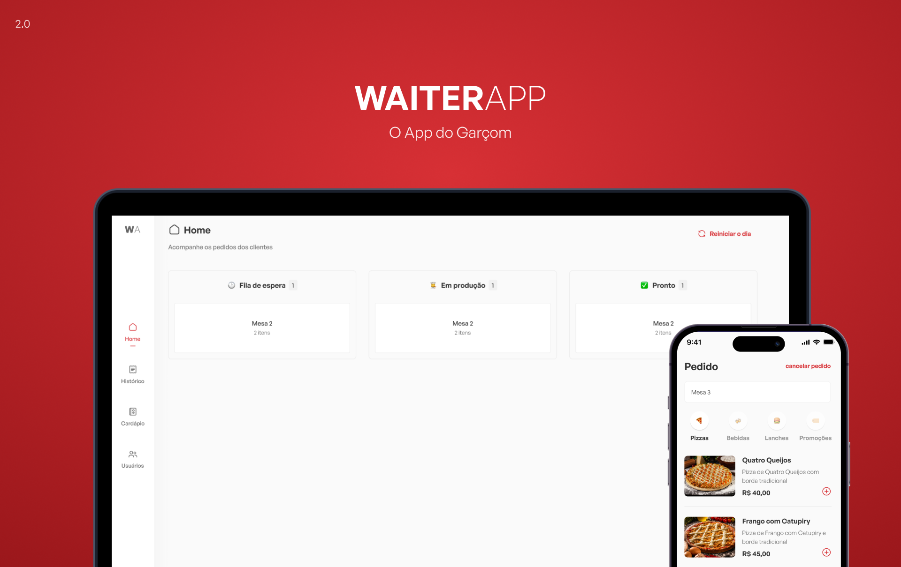

<h4 align="center">
  WaiterAPP 🍔
</h4>

  

  

  

  <a href="#rocket-tecnologia">Tecnologia</a>&nbsp;&nbsp;&nbsp;|&nbsp;&nbsp;&nbsp;
  <a href="#-projeto">Projeto</a>&nbsp;&nbsp;&nbsp;|&nbsp;&nbsp;&nbsp;
  <a href="#-layout">Layout</a>&nbsp;&nbsp;&nbsp;|&nbsp;&nbsp;&nbsp;
  <a href="#-clonar-projeto">Clonar Projeto</a>&nbsp;&nbsp;&nbsp;

 

 

## :rocket: Tecnologia

Tecnologias usadas para o desenvolvimento desse projeto:

- [Node.js](https://nodejs.org/en/)
- [ReactJS](https://reactjs.org)
- [React Native](https://reactnative.dev/)
- [Typescript](https://www.typescriptlang.org/)
- [MongoDB](https://www.mongodb.com/)

Libs:

- [Express](https://expressjs.com/pt-br/)
- [EditorConfig](https://editorconfig.org/)
- [Expo](https://expo.dev/)
- [StyledComponents](https://styled-components.com/)
- [Eslint](https://eslint.org/)
- [react-native-svg](https://github.com/react-native-svg/react-native-svg)

Ver mais <kbd>[package.json](./package.json)</kbd>

## 💻 Projeto

Bem vindo ao <b>Waiter APP</b>, esse projeto tem como intuito desenvolver as minhas habilidade no React Native, ReactJs e NodeJs. Ele foi desenvolvido durante um evento de uma semana chamado "O Poder do Javascript".

## 🔖 Layout

Consulte o layout da aplicação [Figma](https://www.figma.com/file/u8467E3VIbsb5ME9iOYptX/Waiter-App-(2.0)?node-id=11%3A195&t=ciow1HLpCP0fLKg8-1).

## 🤔 Clonar Projeto

- Faça um Fork desse repositório;
- Entre nas pasta backend, frontend, mobile e instale as dependência: `yarn install` ou `npm install`;
- Rodar backend: `yarn dev` ou `npm run dev`;
- Rodar frontend: `yarn dev` ou `npm run dev`;
- Rodar mobile: `yarn start` ou `npm run start`;

Para mais detalhes entre em contato comigo pelo <a href="mailto:andredapperviana@gmail.com">andredapperviana@gmail.com</a>.

---

Feito por André Viana
